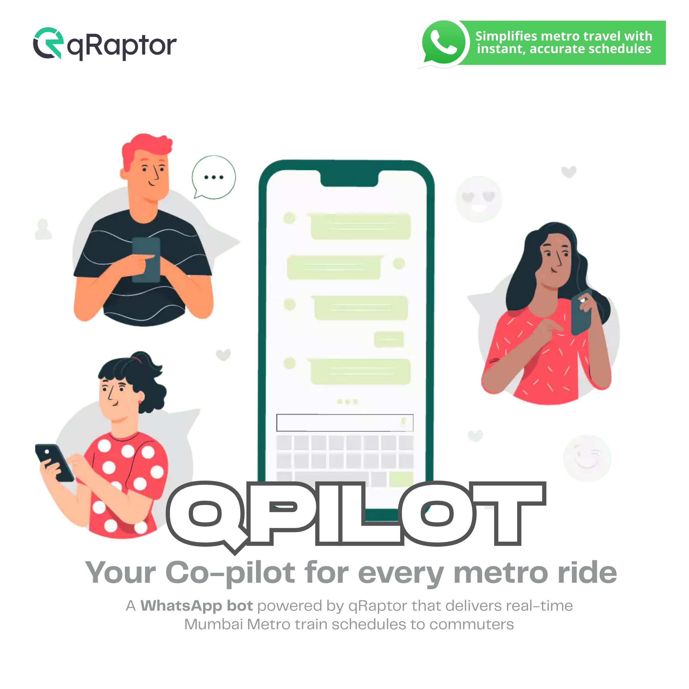
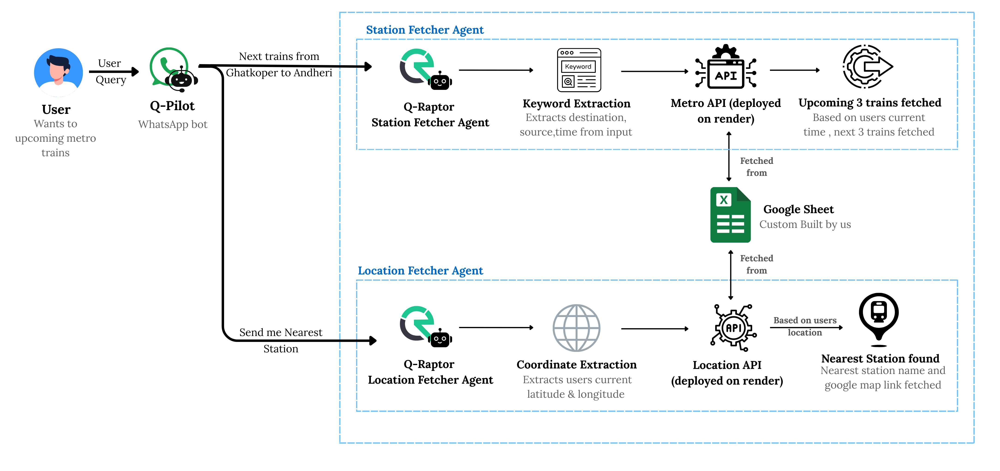
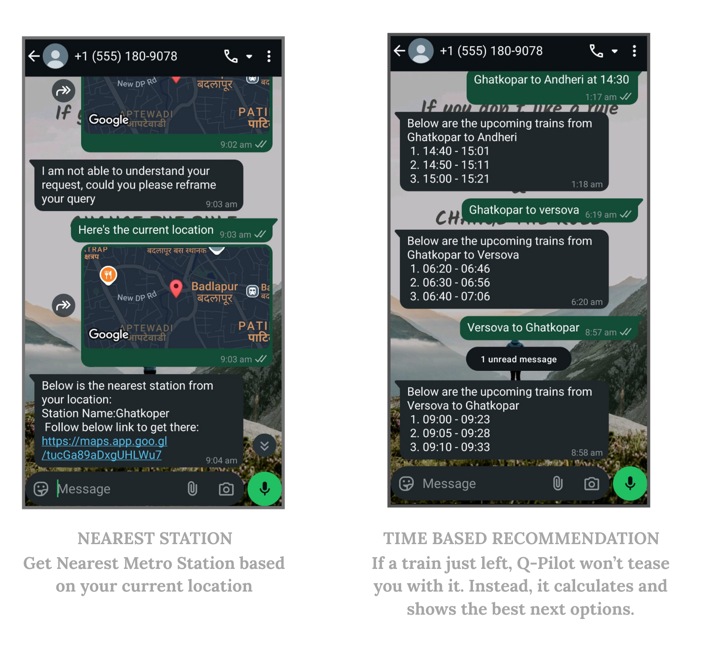

  

## Introduction

Q-Pilot is a WhatsApp-based solution that brings Mumbai Metro information directly to commuters without requiring any app downloads. Built to complement existing transportation tools, Q-Pilot provides real-time metro timetables, station information, and route planning through the familiar WhatsApp interface.

## Documentation & Socials

- [Documentation (GitBook)](https://anisha.gitbook.io/q-pilot/)
- [Demo Video](#)
- [Linkedin Post](https://www.linkedin.com/posts/anisha-shankar-_whatsappbot-smartcommute-urbanmobility-activity-7367409338249789440-JFlW?utm_source=share&utm_medium=member_desktop&rcm=ACoAADRRPDoBVYB6_5xhK2CfJyPKygmNG0FEIfc)
- [Instagram Post](#)

## Problem Statement

- Most commuters avoid downloading yet another app just for metro information, and while Mumbai already has m-indicator, it primarily caters to local train travelers, leaving metro users underserved.
- Mumbai Metro does offer a WhatsApp-based fare and ticket booking bot, but it lacks crucial features like timetables, route details, and station information.
- This creates a clear gap — despite having digital tools in place, metro commuters still don't have a simple, all-in-one solution for journey planning.

**Our Challenge:** Bridge this gap by integrating essential metro information seamlessly into WhatsApp, where users are already active — removing the barrier of app installs while complementing existing systems.

## Solution Overview
Q-Pilot serves as your co-pilot for every metro ride, providing:
- **WhatsApp Integration** – Metro timetables, station details, and nearest station lookup, right on WhatsApp
- **Complement Existing Bot** – Extends the Mumbai Metro fare & ticketing bot with live schedule + navigation
- **Location-Based Assistance** – Auto-detect nearest metro station from shared location
- **Unified Hub** – Timetable + routes + fares in one platform
- **Multilingual Support** – English, Hindi, Marathi
- **No App, No Website** – Just WhatsApp

## Flow of Q-Pliot:

 

## Key Features

- **WhatsApp-first Design** – No app installation required
- **Real-Time Metro Timetable** – Built from scratch (no public dataset existed)
- **Station-based Search** – By name, coordinates, or location share
- **Multilingual Support** – Inclusive design for diverse users
- **Seamless Integration** – Works with Mumbai Metro's existing WhatsApp ticketing bot
- **Scalable Architecture** – Ready for expansion across multiple cities

## Target Audience
- **Daily Commuters** – Office-goers and students
- **First-Time & Occasional Travelers** – New/irregular users of Mumbai Metro
- **Tourists & Visitors** – Outstation travelers who prefer WhatsApp over local apps
- **Elderly / Non-Tech-Savvy Users** – Simple access without app complexity
- **Metro Authorities** – As an official scalable extension to their current bot

## Technology Stack
### Core Technologies
- **WhatsApp Cloud API** – Messaging backbone
- **qRaptor** – Multi-agent orchestration for AI-driven workflows
- **Render** - API Deploying service

### qRaptor Integration

qRaptor helps orchestrate multiple agents working together:
- **Nearest Station Agent** – Location-based lookup
- **Timetable Agent** – Next train calculations

## Usage
- Send location to find nearest metro station
- Text station name to get upcoming trains
- Ask for routes between two stations

### Example Interactions

  

## Impact & Benefits

- **Ease of Access** – Metro info on WhatsApp, no extra app installs
- **Time Savings** – Clear, accurate timetables reduce confusion + waiting time
- **Bridging Gaps** – Complements m-indicator + existing WhatsApp ticketing bot
- **Eco-Friendly Push** – Encourages more people to take metros
- **Inclusive Design** – Even the least tech-savvy can use it
- **Future-Ready** – Ticketing + alerts + route planning all within WhatsApp

## Current Limitations

- **WhatsApp Business Requirements** – Full features need a verified WhatsApp Business account
- **Live Updates** – Cancelled/delayed trains not shown unless official feeds integrated
- **Data Dependency** – Manual updates required for timetables
- **Internet Requirement** – No offline mode available
- **Integration Challenges** – Ticketing/metro APIs need authority collaboration
- **Scalability** – Large-scale adoption requires robust backend infrastructure

## Future Roadmap

### Short Term
- Official Mumbai Metro collaboration for verified timetables
- Integration with Mumbai Local Trains
- "Know Your Station" feature with facilities information
- Emergency assistance integration

### Long Term
- AI-powered route planner combining metro, local trains, buses, and traffic
- QR-based metro ticket booking via WhatsApp
- Expanded multilingual support
- Personalized alerts for saved routes
- Scalability to Delhi, Bangalore, Chennai, Hyderabad metros

## Business Model

- **Enterprise Licensing** – Partner with Mumbai Metro as official bot
- **White-labeling** – Adaptable for other Indian metros
- **Advertising & Partnerships** – Local business collaborations
- **Ticketing Integration** – Revenue share on WhatsApp bookings
- **API-as-a-Service** – Provide metro timetable APIs for other applications

### Contributors
- [Tejas Gadge](https://github.com/tejasgadge2504)
- [Anisha Shankar](https://github.com/hahaanisha)

## Support

For support, questions, or feedback:
- Create an issue on GitHub
- Email: teaminspire2226@gmail.com

---

**Built with ❤️ for Mumbai Metro commuters**
